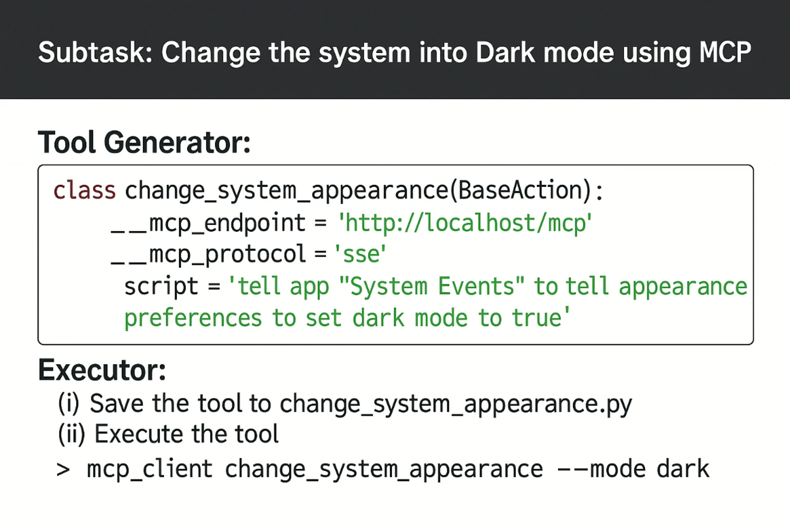

# StrataPilot: Towards Generalist Computer Agents with Self-Improvement

<div align="center">

<p align="center">
  
</p>

</div>

## 📖 Overview

- **StrataPilot** is a pioneering conceptual framework for building generalist computer agents on Linux and MacOS, which provides a unified interface for app interactions in the heterogeneous OS ecosystem.
  
<p align="center">
  
</p>

- Leveraging StrataPilot, we built **FRIDAY**, a self-improving AI assistant capable of solving general computer tasks.

<p align="center">
  
</p>

## ⚡️ Quickstart

1. **Clone the GitHub Repository:** 

   ```
   git clone https://github.com/StrataPilot/StrataPilot.git
   ```

2. **Set Up Python Environment:** Ensure you have a version 3.10 or higher Python environment. You can create and
   activate this environment using the following commands, replacing `stratapilot_env` with your preferred environment
   name:

   ```
   conda create -n stratapilot_env python=3.10 -y
   conda activate stratapilot_env
   ```

3. **Install Dependencies:** Move into the `StrataPilot` directory and install the necessary dependencies by running:

   ```
   cd StrataPilot
   pip install -e .
   ```

4. **Set OpenAI API Key:** Configure your OpenAI API key in [.env](.env) and select the model you wish to use.

5. **Running the Script:** Run the quick_start.py script, simply execute the following command in your terminal:
   ```
   python quick_start.py
   ```

\* FRIDAY currently only supports single-round conversation.

## 🛠️ FRIDAY-Gizmos
We maintain an open-source library of toolkits for FRIDAY, which includes tools that can be directly utilized within FRIDAY.
For a detailed list of tools, please see [FRIDAY-Gizmos](https://github.com/StrataPilot/FRIDAY-Gizmos). The usage methods are as follows:

1. Find the tool you want to use in [FRIDAY-Gizmos](https://github.com/StrataPilot/FRIDAY-Gizmos) and download its tool code.
2. Add the tool to FRIDAY's toolkit:
```shell
python friday/tool_repository/manager/tool_manager.py --add --tool_name [tool_name] --tool_path [tool_path]
```
3. If you wish to remove a tool, you can run:
```shell
python friday/tool_repository/manager/tool_manager.py --delete --tool_name [tool_name]
```

## 💻 User Interface (UI)

**Enhance Your Experience with Our Intuitive Frontend!** This interface is crafted for effortless control of your agents. For more details, visit [FRIDAY Frontend](https://github.com/StrataPilot/FRIDAY-front).

## ✨ Deploy API Services

For comprehensive guidelines on deploying API services, please refer to the [StrataPilot documentation](). 

## 👨‍💻‍ Contributors

<a href="https://github.com/StrataPilot/StrataPilot/graphs/contributors">
  
</a>

<!-- Made with [contrib.rocks](https://contrib.rocks). -->

## 🛡 Disclaimer

StrataPilot is provided "as is" without warranty of any kind. Users assume full responsibility for any risks associated with its use, including **potential data loss** or **changes to system settings**. The developers of StrataPilot are not liable for any damages or losses resulting from its use. Users must ensure their actions comply with applicable laws and regulations.
