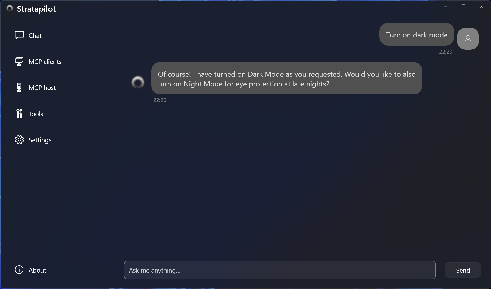
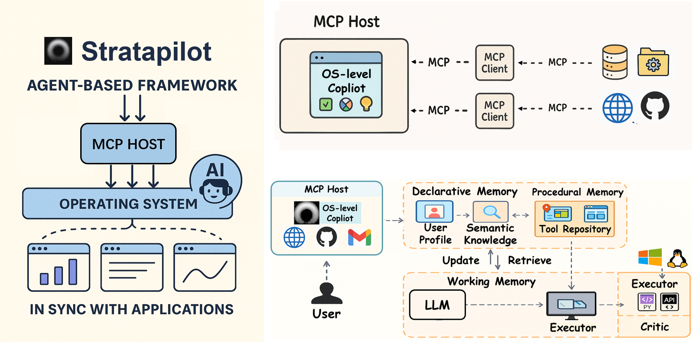
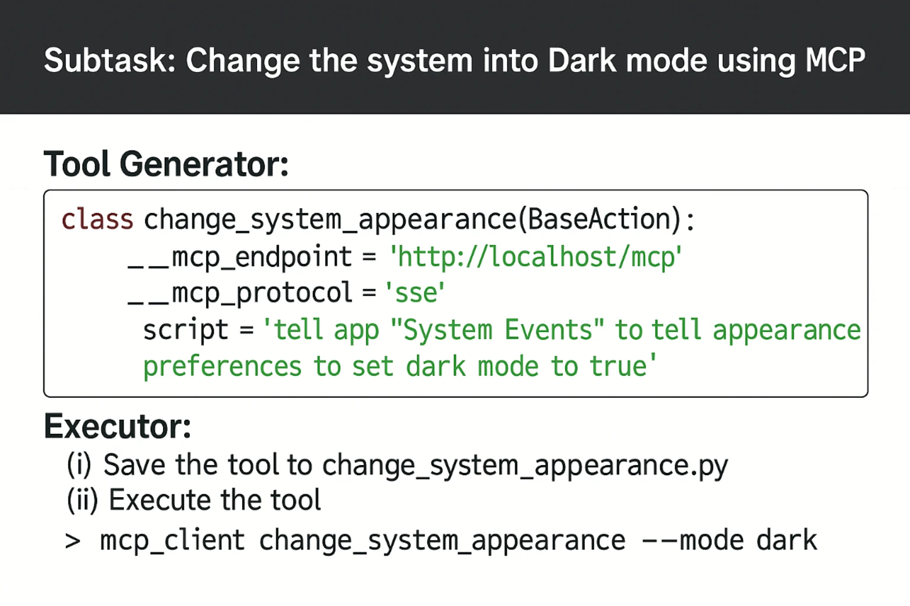

.. Stratapilot documentation master file, created by
   sphinx-quickstart on Thu Feb 29 15:23:26 2024.
   You can adapt this file completely to your liking, but it should at least
   contain the root `toctree` directive.

:github_url: https://github.com/KAIST-KEAI/stratapilot

Introduction
==================================

**stratapilot** is a pioneering conceptual framework for building generalist computer agents on Linux and MacOS, which provides a unified interface for app interactions in the heterogeneous OS ecosystem.

Leveraging stratapilot, we built **FRIDAY**, a self-improving AI assistant capable of solving general computer tasks.

Tutorials
==================================

+--------------+-------------------------------------------------------------------------------------------------+--------------------------------------------------------------------------------------------------------------------------------------+
| Level        | Tutorial                                                                                        | Description                                                                                                                          |
+==============+=================================================================================================+======================================================================================================================================+
| Beginner     | `Installation <installation.html>`_                                                             | Provides three methods to install FRIDAY: cloning from GitHub, development setup via pip install -e ., and direct pip installation.  |
+--------------+-------------------------------------------------------------------------------------------------+--------------------------------------------------------------------------------------------------------------------------------------+
| Beginner     | `Getting Started <quick_start.html>`_                                                           | Demonstrates how to use FRIDAY with a quick_start.py script, covering module imports, configuration setup, and task execution.       |
+--------------+-------------------------------------------------------------------------------------------------+--------------------------------------------------------------------------------------------------------------------------------------+
| Beginner     | `LightFriday <tutorials/light_friday.html>`_                                                    | Demonstrates how to use the ``LightFriday`` agent to execute tasks by planning and executing code.                                   |
+--------------+-------------------------------------------------------------------------------------------------+--------------------------------------------------------------------------------------------------------------------------------------+
| Intermediate | `Adding Your Tools <tutorials/add_tool.html>`_                                                  | Outlines the process for adding and removing tools to the FRIDAY.                                                                    |
+--------------+-------------------------------------------------------------------------------------------------+--------------------------------------------------------------------------------------------------------------------------------------+
| Intermediate | `Deploying API Services <tutorials/deploy_api_service.html>`_                                   | Explains the deployment of API services for FRIDAY, including environment setup, configuring API tools, and launching the server.    |
+--------------+-------------------------------------------------------------------------------------------------+--------------------------------------------------------------------------------------------------------------------------------------+
| Intermediate | `Example: Automating Excel Tasks <tutorials/example_excel.html>`_                               | Demonstrates automating Excel tasks with FRIDAY, including formula application and chart creation within an Excel sheet.             |
+--------------+-------------------------------------------------------------------------------------------------+--------------------------------------------------------------------------------------------------------------------------------------+
| Intermediate | `Enhancing FRIDAY with Self-Learning for Excel Task Automation <tutorials/self_learning.html>`_ | Showcases empowering FRIDAY with self-learning to autonomously learn and execute Excel file manipulations.                           |
+--------------+-------------------------------------------------------------------------------------------------+--------------------------------------------------------------------------------------------------------------------------------------+
| Advanced     | `Designing New API Tools <tutorials/design_new_api_tool.html>`_                                 | Guides on designing, integrating, and deploying custom API tools for FRIDAY to extend its functionalities.                           |
+--------------+-------------------------------------------------------------------------------------------------+--------------------------------------------------------------------------------------------------------------------------------------+

Community
==================================

Join our community to connect with other enthusiasts, share your tools and demos, and collaborate on innovative projects. Stay engaged and get the latest updates by following us:

- **Twitter**: Follow us on Twitter `@keaistrata <https://x.com/keaistrata>`_ for the latest news, updates, and highlights from our community.

Contributing
==================================

**strataPilot** thrives on community contributions, and we welcome involvement in any form. Whether it's adding new tools, fixing bugs, improving documentation, or sharing ideas, every contribution counts. Join our community to advance this exciting project together!

Ways to Contribute
----------------------

- **Code:** Enhance stratapilot by adding new features, fixing bugs, or optimizing existing tools.

- **Documentation:** Help make stratapilot more accessible by improving or expanding our documentation.

- **Feedback and Ideas:** Share your insights and suggestions to make stratapilot even better.

- **Advocacy:** Spread the word about stratapilot and help grow our community.

Citation
==================================

For more detailed information about stratapilot and FRIDAY, please refer to our latest research paper:

.. code-block:: bibtex
   
   @misc{wu2024oscopilot,
      title={stratapilot: Towards Generalist Computer Agents with Self-Improvement}, 
      author={Zhiyong Wu and Chengcheng Han and Zichen Ding and Zhenmin Weng and Zhoumianze Liu and Shunyu Yao and Tao Yu and Lingpeng Kong},
      year={2024},
      eprint={2402.07456},
      archivePrefix={arXiv},
      primaryClass={cs.AI}
   }

.. toctree::
   :hidden:
   :maxdepth: 2
   :caption: Getting Started

   installation
   quick_start

.. toctree::
   :hidden:
   :maxdepth: 2
   :caption: Tutorials

   tutorials/add_tool
   tutorials/deploy_api_service
   tutorials/design_new_api_tool
   tutorials/example_excel
   tutorials/self_learning
   tutorials/light_friday

.. toctree::
   :hidden:
   :maxdepth: 2
   :caption: Modules

   agent
   tool_repository
   environment
   utils

.. Indices and tables
.. ==================

.. * :ref:`genindex`
.. * :ref:`modindex`
.. * :ref:`search`
